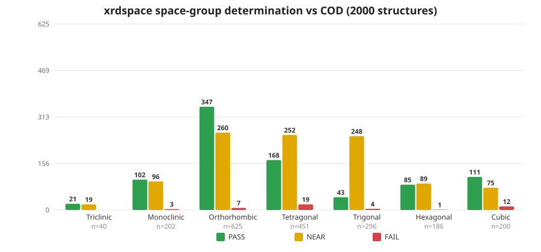

# xrdspace

**xrdspace** is a JavaScript (Node.js) tool for **space-group determination and
reflection merging** of X-ray diffraction data — an XPREP/POINTLESS-style
analysis of HKL files. It reads reflection data, determines the crystal system,
Laue class, lattice centering and space group, merges the data under the
determined symmetry, and writes out files ready for structure solution with
SHELXD / SHELXT / SHELXS.

- Pure JavaScript (ES modules), **zero runtime dependencies** — runs on any
  Node.js 18+ installation.
- Works both as a **command-line tool** (POINTLESS-style arguments) and as a
  **library** (import `analyzeHkl` from your own code or server).
- Ships with a complete dictionary of all **230 space groups** (every setting,
  with full general-position symmetry operations).
- Validated against **2000 real structures from the Crystallography Open
  Database (COD)**: the published space group is recovered exactly (PASS) or
  appears among the zero-violation candidates (NEAR) in **97.7 %** of assessed
  entries — and against **real macromolecular (protein) data**, where every
  determined space group is chiral (Sohncke).

---

## Features

| Step | What xrdspace does |
|---|---|
| 1. Parse | Reads **XDS_ASCII**, **SHELX five-column** and **COD `.hkl` (CIF)** files, extracting reflections, unit cell, wavelength, title |
| 2. Crystal system | From the unit-cell metric (length/angle tolerances), with automatic fallback when the data demands lower symmetry than the metric suggests (pseudo-symmetry) |
| 3. Laue class | R(sym) merge test over all 11 Laue classes (all settings of 2/m tried); the highest-symmetry metric-compatible class whose R(sym) is close to the intrinsic (−1) merge is chosen |
| 4. Centering | Bravais lattice (P/A/B/C/I/F/R) from reflection parity (systematic absences of the centering conditions), picking the most restrictive centering with no significant violations |
| 5. Space group | All candidates of the crystal system + centering are scored by their **systematic-absence conditions** (screw axes and glide planes, op by op, including absences that are simply missing from the data). Ranking: fewest violations → most confirmed absences → Laue-class match → Wilson centricity match. For macromolecular cells (volume > 64 000 ų, ≈ 40×40×40) candidates are restricted to the **65 chiral (Sohncke) space groups** — see below |
| 6. Centricity | Wilson-style test on \|E²−1\| (centric ≈ 0.968, acentric ≈ 0.736) used as a tie-breaker |
| 7. Merge | Reflections merged under the chosen Laue class with 1/σ² weights; merged σ combines the weighted-mean error with the sample scatter |
| 8. Output | Merged **SHELX** HKL, merged **XDS_ASCII** HKL, a **SHELX `.ins`** instruction file (cell, LATT, SYMM, SFAC/UNIT), and a full merging report (R(merge), R(meas), R(pim), completeness, multiplicity, mean I/σ) |

---

## Requirements

- **Node.js 18 or newer** (uses built-in `fetch` in the test harness; the
  library itself only needs `node:fs`, `node:vm`, `node:path`, `node:url`).
- No `npm install` needed — there are no dependencies.

```sh
git clone https://github.com/dspasyuk/xrdspace.git
cd xrdspace
```

---

## Command-line usage

```
node src/xrdspace.js --hklin <file.hkl> [options]
```

Bare POINTLESS-style keywords (`hklin`, `hklout`, `spacegroup`, `cell`, …) are
accepted as well, and a bare filename as the first argument is treated as the
input file:

```sh
node src/xrdspace.js hklin data.hkl hklout merged.hkl spacegroup "P 21/c"
```

### Options

| Option | Description |
|---|---|
| `--hklin <file>` | Input HKL file (XDS_ASCII, SHELX five-column, or COD `.hkl`) |
| `--hklout <file>` | Output merged HKL file in **SHELX format** (default: `<input>_merged.hkl`) |
| `--xdsout <file>` | Output merged HKL file in **XDS_ASCII format** (default: `<input>_XDS.HKL`) |
| `--log <file>` | Also write all console output to a log file (truncated at start of run) |
| `--spacegroup <sg>` | **Force** a specific space group — number (`14`) or Hermann–Mauguin symbol (`"P 21/c"`, `"P-1"`, `"P 21 21 21"`). Used for merging/output and checked for consistency with the data |
| `--laue <group>` | **Force** a Laue class for merging (e.g. `-1`, `2/m`, `mmm`, `4/mmm`, `-3m`, `6/mmm`, `m-3m`) |
| `--cell "a b c alpha beta gamma"` | Unit cell, used when the file does not carry cell parameters (skips the interactive prompt) |
| `--resolution "lo hi"` | Restrict the analysis to a resolution range in Å (low = large d, high = small d) |
| `--sigthreshold <n>` | I/σ(I) significance threshold for systematic-absence tests (default `5`) |
| `--sfac "C H N O"` | Expected elements — or a formula such as `"C12 H16 N2 O4"` — written into the SHELX `.ins` `SFAC`/`UNIT` lines for SHELXT |
| `--chiral` | Restrict candidates to the 65 **chiral (Sohncke)** space groups. This is the **default for macromolecular cells** (volume > 64 000 ų, ≈ 40×40×40 Å) |
| `--no-chiral` | Allow non-chiral (centrosymmetric / mirror) space groups even for large cells |
| `--help`, `-h` | Show help |
| `--version`, `-v` | Show version |

If the input file has no unit-cell parameters and `--cell` is not given,
xrdspace **prompts interactively** for `a b c alpha beta gamma`.

### Example

```sh
node src/xrdspace.js --hklin data_XDS.HKL \
    --spacegroup "P 21/c" \
    --sfac "C12 H16 N2 O4" \
    --resolution 50 1.2 \
    --log run.log
```

### Example output

```
==============================================
  xrdspace  —  space-group determination
==============================================
  Format             : xds_ascii
  Unit cell          : 10.5 10.5 14.0  90 90 90
  Wavelength         : 0.71073
  Reflections        : 123456
  Crystal system     : tetragonal
  Lattice centering  : P
  Centrosymmetric    : centric  (<|E^2-1|> = 0.971)
  Laue class         : 4/mmm   R(sym) = 1.82 %
----------------------------------------------
  R(sym) by Laue class:
    -1      order  2  R(sym) = 3.41 %
    2/m     order  4  R(sym) = 3.38 %
    mmm     order  8  R(sym) = 2.95 %
    4/m     order  8  R(sym) = 2.10 %
    4/mmm   order 16  R(sym) = 1.82 %  <--
    ...
----------------------------------------------
  Space-group candidates (systematic absences):
      87  I 4/m              violations    0
      88  I 41/a             violations    0
      84  P 42/m             violations    0  <-- best
  ...
  Best space group  : P 42/m  (No. 84)
  Data consistency  : consistent with data
----------------------------------------------
  Merging statistics:
    Resolution range : 50.00 - 1.20 A
    Observations     : 123456
    Unique           : 7712
    Multiplicity     : 16.0
    Completeness     : 98.7 %
    R(merge)         : 1.82 %
    R(pim)           : 0.46 %
    Mean I/sigma(I)  : 12.3
==============================================
Merged HKL written to:
  data_merged.hkl  (SHELX format, ready for SHELXD/SHELXT)
  data_XDS.HKL     (merged XDS_ASCII)
  data_merged.ins  (SHELX instructions, matching cell/space group)
```

### Chiral (Sohncke) space groups for macromolecular data

Protein and other macromolecular crystals are almost always in one of the
**65 chiral (Sohncke) space groups** — groups without inversion, mirrors,
glides or roto-inversions. To avoid reporting a non-chiral group (e.g.
`P 21/c`) for a protein dataset, xrdspace automatically restricts the
candidates to the Sohncke groups when the **unit-cell volume exceeds
64 000 ų** (a 40 × 40 × 40 Å cube):

- The restriction is **not a hard veto**: if no Sohncke group is consistent
  with the systematic absences (i.e. every chiral candidate has violations),
  xrdspace falls back to the full candidate list, so a genuinely
  non-centrosymmetric-free large cell is still handled.
- The restriction is reported in the output:
  `Chiral restriction : on (Sohncke space groups only)`.
- Override it explicitly with `--chiral` (force on) or `--no-chiral`
  (force off).

### Output files

| File | Format | Use |
|---|---|---|
| `<input>_merged.hkl` | SHELX five-column `H K L I SIG(I)` | Feed directly to **SHELXD / SHELXT / SHELXS** |
| `<input>_XDS.HKL` | Merged XDS_ASCII (`MERGE=TRUE`, `FRIEDELS_LAW=TRUE`) with cell, space group, wavelength and resolution-range header | Re-integration / further processing |
| `<input>_merged.ins` | SHELX instruction file: `TITL`, `CELL`, `LATT` (sign encodes centrosymmetry), `SYMM` (generating operations, one per inversion pair for centric groups), `SFAC`, `UNIT`, `HKLF 4`, `TREF 50` | Structure solution with SHELXT |

---

## Library API

```js
import { analyzeHkl, loadSpaceGroups, resolveSpaceGroup, verdict } from './src/index.js';
```

### `analyzeHkl(text, options)`

Runs the full analysis on HKL file **text** and returns a result object.

**Options**

| Option | Type | Description |
|---|---|---|
| `cell` | `{a,b,c,alpha,beta,gamma}` | Unit cell, required when the file has none |
| `spaceGroup` | `number \| string` | Force a space group (number or Hermann–Mauguin / Hall symbol) |
| `laue` | `string` | Force a Laue class for merging (e.g. `'2/m'`, `'mmm'`) |
| `resolution` | `{dmin, dmax}` | Restrict analysis to a resolution range (Å) |
| `sigThreshold` | `number` | I/σ threshold for systematic absences (default `5`) |
| `xdsOutput` | `string` | `OUTPUT_FILE` name written into the merged XDS_ASCII header |
| `sfac` | `string[]` | Element symbols for the `.ins` `SFAC` line |
| `unit` | `number[]` | Counts per element for the `.ins` `UNIT` line |
| `chiral` | `boolean` | Restrict candidates to the 65 chiral (Sohncke) space groups. Default: `true` for cells with volume > 64 000 ų (≈ 40×40×40), `false` otherwise |

**Return value**

```js
{
  ok: true,
  cell: { a, b, c, alpha, beta, gamma },
  summary: {
    format, title, wavelength, nReflections,
    crystalSystem, metricSystem, uniqueAxis,
    laueClass, laueRSym, centering,
    centricity,          // 'centric' | 'acentric' | 'indeterminate'
    centricityScore,     // <|E^2-1|>
    chiral,              // true when the Sohncke (chiral) restriction was applied
    forced,              // true when a space group was forced
    bestSpaceGroup, bestSpaceGroupNumber,
    merged: { nUnique, nObs, completeness, rMerge, rPim, meanIsig, meanMultiplicity }
  },
  laueTable:        [{ name, order, rsym, nOrbits, chosen }],
  centeringResults: { P: {...}, A: {...}, B: {...}, C: {...}, I: {...}, F: {...}, R: {...} },
  candidates:       [{ id, hm, hs, laue, centric, violations, confirmedOps, confirmedAbsences }],  // top 30
  best:             { id, hm, hs },   // space group used (forced or determined)
  determined:       { id, hm, hs },   // space group determined from the data
  forced:           { id, hm, hs } | null,
  merge: {
    nUnique, nObs,
    shelxHkl,            // merged SHELX five-column text
    xdsAscii,            // merged XDS_ASCII text
    shelxIns,            // SHELX .ins text
    statistics: { dmin, dmax, nObs, nUnique, meanMultiplicity, completeness,
                  rMerge, rMeas, rPim, meanIsig, meanI },
    report,              // human-readable merging report
    consistency: { violations, confirmedOps, confirmedAbsences }
  }
}
```

On failure the result is `{ ok: false, error }` where `error` is a message or
the special code `'NO_CELL'` (the file has no unit cell — supply `options.cell`).

### Other exports

| Export | Description |
|---|---|
| `loadSpaceGroups()` | The full 230-space-group dictionary (all settings): `{id, hm, hs, o, s[]}` |
| `getLaueGroups()` | The 11 Laue classes with reciprocal-space operation matrices |
| `resolveSpaceGroup(sgData, spec)` | Resolve a space group by number or symbol |
| `writeShelxIns(sg, cell, options)` | Generate a SHELX `.ins` file for a given space group and cell |
| `verdict(result)` | One-line verdict string, e.g. `"P 21/c (No. 14)"` |
| `isSohncke(sg)` | `true` when a space group is chiral (no op with negative rotation determinant) |
| `cellVolume(cell)` | Unit-cell volume in ų |

---

## Supported input formats

| Format | Detection | Notes |
|---|---|---|
| **XDS_ASCII** | `!` header lines | Cell from `!UNIT_CELL_CONSTANTS=`, plus `SPACE_GROUP_NUMBER/NAME`, `X-RAY_WAVELENGTH`, `MERGE`, `FRIEDELS_LAW` |
| **SHELX five-column** | 5+ numeric columns `H K L I SIG(I)` | No cell in the file — provide `--cell` |
| **COD `.hkl`** | CIF `loop_` with `_refln_` keys | Reads `F²_meas` (+σ), `I_meas` (+σ), `F_meas` (+σ) or `f_obs` (+σ); cell must be supplied |

---

## How it works

1. **Crystal system from the metric** — length equality (0.5 %) and angle
   (1°) tolerances classify the cell as cubic / tetragonal / hexagonal /
   trigonal (rhombohedral) / orthorhombic / monoclinic (unique axis detected) /
   triclinic.
2. **Laue class by R(sym)** — for each of the 11 Laue classes (all settings of
   2/m are tried) the reflections are merged under the class's reciprocal
   matrices and R(sym) is computed (strongest 30 000 reflections for very large
   data). The chosen class is the highest-symmetry one compatible with the
   metric whose R(sym) is within `max(7 %, 2 × R(sym) of −1)`; otherwise the
   crystal system is downgraded to match the data (pseudo-symmetry handling).
3. **Centering by parity** — each Bravais condition (e.g. C: h+k = 2n, F:
   h,k,l unmixed, R: −h+k+l = 3n) is checked; reflections above the I/σ
   threshold that are forbidden count as violations. The most restrictive
   centering with zero violations (and no significant weak-forbidden presence)
   wins.
4. **Systematic absences** — for every candidate space group (crystal system +
   centering, all settings of a given number scored and the best kept) each
   screw/glide operation with a non-lattice translation is tested: reflections
   invariant under the operation must have phase `h·t ≈ 0 mod 1`. Strong
   violations reject the group; confirmed absences (weak or entirely missing
   forbidden reflections along the invariant axes/planes) rank it. For
   macromolecular cells (volume > 64 000 ų) the candidate pool is first
   restricted to the 65 Sohncke (chiral) groups — a group is chiral when none
   of its operations has a negative rotation determinant — with automatic
   fallback to the full pool if no chiral group is consistent with the data.
5. **Centricity** — the Wilson statistic <|E²−1|> (E² = I/⟨I⟩) distinguishes
   centric (≈ 0.968) from acentric (≈ 0.736) data and breaks remaining ties.
6. **Merging** — reflections are grouped into Laue orbits (canonical
   representative = lexicographically smallest image), merged with 1/σ²
   weights; the merged σ adds the standard error of the mean so inconsistent
   observations inflate the error. Completeness is computed against the exact
   count of unique reflections in the resolution shell (analytic per-(h,k)
   l-bounds, no full-cube scan).

---

## Validation against the COD

`tests/xrdspace-cod.js` downloads reflection files for **2000 COD entries**
(one per space group where possible, cached in `HKLs/cod/`), runs the
determination with each entry's published unit cell, and compares the result
with the published space group:

- **PASS** — exact space-group number match
- **NEAR** — the published group is among the zero-violation candidates
  (symmetry/setting ambiguities that absences alone cannot always resolve)
- **FAIL** — the published group was not recovered
- **SKIP** — unusable data (powder pattern, no single-crystal reflections)

```sh
node tests/xrdspace-cod.js              # all 2000 entries
node tests/xrdspace-cod.js 1100908      # a specific COD entry
node tests/xrdspace-cod.js --limit 50   # first N entries
node tests/xrdspace-cod.js --sg 14      # only space group 14
```

Latest full run (see `tests/xrdspace-report.json` and the chart
`tests/xrdspace-report.svg`):

| Crystal system | Total | PASS | NEAR | FAIL | SKIP |
|---|---:|---:|---:|---:|---:|
| Triclinic | 40 | 21 | 19 | 0 | 0 |
| Monoclinic | 202 | 102 | 96 | 3 | 1 |
| Orthorhombic | 625 | 347 | 260 | 7 | 11 |
| Tetragonal | 451 | 168 | 252 | 19 | 12 |
| Trigonal | 296 | 43 | 248 | 4 | 1 |
| Hexagonal | 186 | 85 | 89 | 1 | 11 |
| Cubic | 200 | 111 | 75 | 12 | 2 |
| **Total** | **2000** | **877** | **1039** | **46** | **38** |

**97.7 %** of assessed entries have the published space group either
determined exactly or present among the zero-violation candidates. The
remaining failures are genuine pseudo-symmetry and sparse-data ambiguities
(the test exits non-zero only if the rate drops below 90 %).



---

## Validation against macromolecular (MX) data

`tests/xrdspace-mx.js` validates against **real protein diffraction data** —
XDS_ASCII.HKL files from a synchrotron campaign, each with a POINTLESS run
(`pointless.xml`) whose `<BestSolution Type="spacegroup">` is the ground truth.
These are large macromolecular cells (V ≈ 5.6 × 10⁵ – 1.1 × 10⁶ ų), so the
**chiral (Sohncke) restriction is active** on every dataset.

```sh
# point XRDSPACE_MX_DIR at a directory containing hkl/ and xml/ subdirs
XRDSPACE_MX_DIR=/path/to/mx node tests/xrdspace-mx.js
# or: npm run test:mx
```

On a recent run of 18 macromolecular datasets:

| Result | Count |
|---|---:|
| PASS (exact space-group match) | 16 |
| NEAR (in zero-violation candidates) | 0 |
| FAIL | 2 |
| **Correct (PASS + NEAR)** | **88.9 %** |
| **Non-chiral determinations** | **0** |

The two non-PASS cases are weak-data situations where POINTLESS itself
returned a low-confidence, low-symmetry "safe" answer; xrdspace returned a
metrically-consistent higher-symmetry group. In every case the determined
space group was **chiral** — the original motivation for the Sohncke
restriction (never reporting a non-chiral group for a protein) is fully met.

The per-dataset report (`tests/xrdspace-mx-report.json`) is written locally
and is **not committed** (it identifies the samples).

---

## Project structure

```
xrdspace/
├── src/
│   ├── xrdspace.js        # command-line interface (POINTLESS-style arguments)
│   ├── index.js           # main entry point / public API (analyzeHkl, ...)
│   ├── hkl-parser.js      # XDS_ASCII / SHELX / COD .hkl parsers
│   ├── analyze.js         # crystal system, R(sym) Laue selection, centering,
│   │                      #   systematic-absence scoring, centricity, ranking
│   ├── laue.js            # the 11 Laue classes (built from the dictionary)
│   ├── merge.js           # reflection merging, statistics, SHELX/XDS/.ins writers
│   ├── op-math.js         # symmetry-operation parsing and direct↔reciprocal math
│   └── space-groups.js    # dictionary of all 230 space groups (all settings)
├── tests/
│   ├── xrdspace-cod.js    # COD validation harness (2000 entries)
│   ├── cod-picks.json     # the 2000 COD entries (id, cell, published SG)
│   ├── xrdspace-mx.js     # macromolecular (MX) validation harness
│   ├── xrdspace-report.json  # latest COD validation results
│   ├── xrdspace-report.svg   # PASS/NEAR/FAIL chart per crystal system
│   └── xrdspace-report.png   # PNG render of the COD chart
├── package.json
├── LICENSE                # MIT
└── README.md
```

---

## License

MIT — see [LICENSE](LICENSE). Copyright (c) 2026 Denis Spasyuk.
